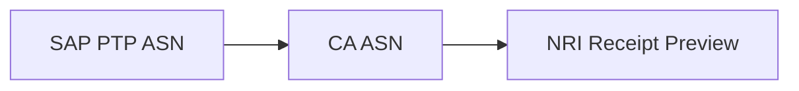
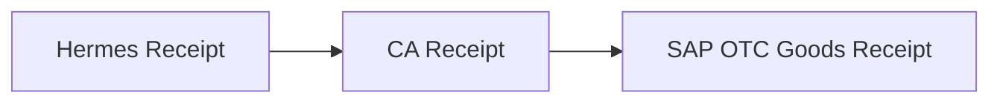
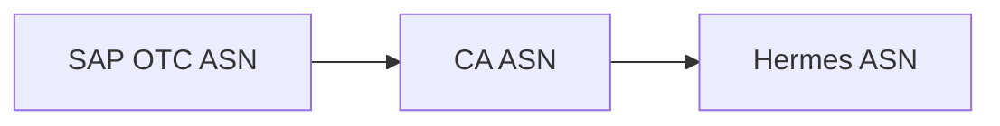
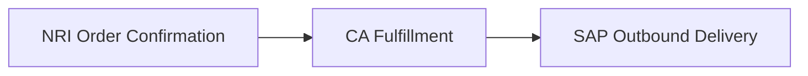
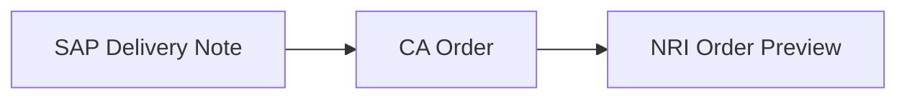
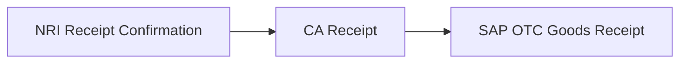
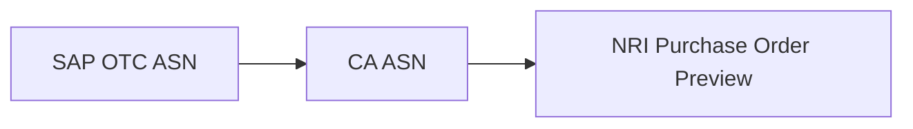
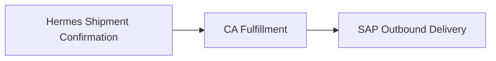
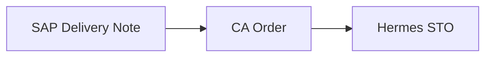

# Scope

## Deliverables

|     | Deliverable                           | Assigned     | Informed     | Flow   | Hermes Epic          | Status                                                                          |
| --- | ------------------------------------- | ------------ | ------------ | ------ | -------------------- | ------------------------------------------------------------------------------- |
| 1   | SAP PTP Goods Receipt Requirements    | `Boomi`      | `CA`         | `1.79` |                      |                |
| 2   | Get ASN Receipt Payload               | `CA`         | `Boomi`      | `1.80` |                      |  |
| 3   | NRI Integration Requirements          | `NRI`        | `CA`         | `1.79` |                      |               |
| 4   | SAP PTP ASN Requirements              | `Boomi`      | `CA`         | `1.79` |                      |                 |
| 5   | Create ASN Payload                    | `CA`         | `Boomi`      | `1.79` |                      |  |
| 6   | Create ASN API                        | `CA`         | `Boomi`      | `1.79` |                      |               |
| 7   | Get ASN Receipt API                   | `CA`         | `Boomi`      | `1.80` |                      |                 |
| 11  | SAP OTC Goods Receipt Requirements    | `Boomi`      | `CA`         | `1.72` |                      |                 |
| 12  | ASN Receipt Payload                   | `CA`         | `Half Helix` | `1.76` | `Inbound Shipments`  |                 |
| 13  | Create ASN Receipt API                | `CA`         | `Half Helix` | `1.76` | `Inbound Shipments`  |               |
| 14  | Get ASN Receipt API                   | `CA`         | `Boomi`      | `1.72` |                      |                 |
| 21  | Hermes ASN Requirements               | `Half Helix` | `CA`         | `1.75` | `Inbound Shipments`  |                |
| 22  | SAP OTC ASN Requirements              | `Boomi`      | `CA`         | `1.75` |                      |                |
| 23  | ASN Webhook Payload                   | `CA`         | `Half Helix` | `1.75` | `Inbound Shipments`  |                 |
| 24  | Create ASN Payload                    | `CA`         | `Boomi`      | `1.71` |                      |                 |
| 25  | ASN Webhook Endpoint                  | `Half Helix` | `CA`         | `1.75` | `Inbound Shipments`  |                 |
| 26  | Create ASN API                        | `CA`         | `Boomi`      | `1.71` |                      |                 |
| 31  | SAP Outbound Delivery Requirements    | `Boomi`      | `CA`         | `1.74` |                      |               |
| 32  | Example Fulfillment Response          | `CA`         | `Boomi`      | `1.74` |                      |               |
| 33  | Get Order API                         | `CA`         | `Boomi`      | `1.74` |                      |               |
| 41  | SAP Delivery Note Requirements        | `Boomi`      | `CA`         | `1.73` |                      |               |
| 42  | Create Order Payload                  | `CA`         | `Boomi`      | `1.73` |                      |               |
| 43  | Create Order API                      | `CA`         | `Boomi`      | `1.73` |                      |               |
| 51  | SAP OTC Goods Receipt Requirements    | `Boomi`      | `CA`         | `1.72` |                      |                 |
| 52  | Get ASN Receipt API                   | `CA`         | `Boomi`      | `1.72` |                      |                 |
| 61  | SAP OTC ASN Requirements              | `Boomi`      | `CA`         | `1.71` |                      |                |
| 62  | Create ASN Payload                    | `CA`         | `Boomi`      | `1.71` |                      |                 |
| 63  | Create ASN API                        | `CA`         | `Boomi`      | `1.71` |                      |                 |
| 71  | SAP Outbound Delivery Requirements    | `Boomi`      | `CA`         | `1.74` |                      |               |
| 72  | Example Fulfillment Response          | `CA`         | `Boomi`      | `1.74` |                      |               |
| 73  | Shipment Confirmation Webhook Payload | `CA`         | `Half Helix` | `1.78` | `Outbound Shipments` |               |
| 74  | Shipment Confirmation API             | `CA`         | `Half Helix` | `1.78` | `Outbound Shipments` |               |
| 75  | Get Order API                         | `CA`         | `Boomi`      | `1.74` |                      |               |
| 81  | Hermes STO Requirements               | `Half Helix` | `CA`         | `1.77` | `Outbound Shipments` |               |
| 82  | SAP Delivery Note Requirements        | `Boomi`      | `CA`         | `1.73` |                      |               |
| 83  | Create Order Payload                  | `CA`         | `Boomi`      | `1.73` |                      |               |
| 84  | Create Order API                      | `CA`         | `Boomi`      | `1.73` |                      |               |

## NRI Receipt Preview API Integration

NRI's Receipt Preview API is used to communicate carton level information and the carton's GS1-128 label to the warehouse so that the contents of the carton will be received automatically simply by scanning the carton label.

### Factory to Warehouse

#### Advanced Ship Notice

##### Dataflow

##### Deliverables

|     | Deliverable                        | Assigned | Informed | Flow   | Hermes Epic | Status                                                                          |
| --- | ---------------------------------- | -------- | -------- | ------ | ----------- | ------------------------------------------------------------------------------- |
| 1   | SAP PTP Goods Receipt Requirements | `Boomi`  | `CA`     | `1.79` |             |                |
| 2   | Get ASN Receipt Payload            | `CA`     | `Boomi`  | `1.80` |             |  |
| 3   | NRI Integration Requirements       | `NRI`    | `CA`     | `1.79` |             |               |
| 4   | SAP PTP ASN Requirements           | `Boomi`  | `CA`     | `1.79` |             |                 |
| 5   | Create ASN Payload                 | `CA`     | `Boomi`  | `1.79` |             |  |
| 6   | Create ASN API                     | `CA`     | `Boomi`  | `1.79` |             |               |
| 7   | Get ASN Receipt API                | `CA`     | `Boomi`  | `1.80` |             |                 |

## Store STOs and ASNs

Physically transfer goods between Retail Stores and Warehouse.

### Warehouse to Store

#### Receipt Confirmation

##### Dataflow

##### Deliverables

|     | Deliverable                        | Assigned | Informed     | Olympus Flow | Hermes Epic         | Status                                                             |
| --- | ---------------------------------- | -------- | ------------ | ------------ | ------------------- | ------------------------------------------------------------------ |
| 1   | SAP OTC Goods Receipt Requirements | `Boomi`  | `CA`         | `1.72`       |                     |    |
| 2   | ASN Receipt Payload                | `CA`     | `Half Helix` | `1.76`       | `Inbound Shipments` |    |
| 3   | Create ASN Receipt API             | `CA`     | `Half Helix` | `1.76`       | `Inbound Shipments` |  |
| 4   | Get ASN Receipt API                | `CA`     | `Boomi`      | `1.72`       |                     |    |

#### Advanced Ship Notice

##### Dataflow

##### Deliverables

|     | Deliverable              | Assigned     | Informed     | Olympus Flow | Hermes Epic         | Status                                                            |
| --- | ------------------------ | ------------ | ------------ | ------------ | ------------------- | ----------------------------------------------------------------- |
| 1   | Hermes ASN Requirements  | `Half Helix` | `CA`         | `1.75`       | `Inbound Shipments` |  |
| 2   | SAP OTC ASN Requirements | `Boomi`      | `CA`         | `1.75`       |                     |  |
| 3   | ASN Webhook Payload      | `CA`         | `Half Helix` | `1.75`       | `Inbound Shipments` |   |
| 4   | Create ASN Payload       | `CA`         | `Boomi`      | `1.71`       |                     |   |
| 5   | ASN Webhook Endpoint     | `Half Helix` | `CA`         | `1.75`       | `Inbound Shipments` |   |
| 6   | Create ASN API           | `CA`         | `Boomi`      | `1.71`       |                     |   |

#### Ship Confirmation

##### Changes

| Status                                                           | Change                                       | Reason                                                           |
| ---------------------------------------------------------------- | -------------------------------------------- | ---------------------------------------------------------------- |
|  | Map LicensePlate from NRI Order Confirmation | This number is printed on the carton labels for Retail Shipments |

##### Dataflow

##### Deliverables

|     | Deliverable                        | Assigned | Informed | Olympus Flow | Hermes Epic | Status                                                             |
| --- | ---------------------------------- | -------- | -------- | ------------ | ----------- | ------------------------------------------------------------------ |
| 1   | SAP Outbound Delivery Requirements | `Boomi`  | `CA`     | `1.74`       |             |  |
| 2   | Example Fulfillment Response       | `CA`     | `Boomi`  | `1.74`       |             |  |
| 3   | Get Order API                      | `CA`     | `Boomi`  | `1.74`       |             |  |

#### Stock Transfer Order

##### Dataflow

##### Deliverables

| #   | Deliverable                    | Assigned | Informed | Olympus Flow | Hermes Epic | Status                                                             |
| --- | ------------------------------ | -------- | -------- | ------------ | ----------- | ------------------------------------------------------------------ |
| 1   | SAP Delivery Note Requirements | `Boomi`  | `CA`     | `1.73`       |             |  |
| 2   | Create Order Payload           | `CA`     | `Boomi`  | `1.73`       |             |  |
| 3   | Create Order API               | `CA`     | `Boomi`  | `1.73`       |             |  |

### Store to Warehouse

#### Receipt Confirmation

##### Dataflow

##### Deliverables

|     | Deliverable                        | Assigned | Informed | Olympus Flow | Hermes Epic | Status                                                           |
| --- | ---------------------------------- | -------- | -------- | ------------ | ----------- | ---------------------------------------------------------------- |
| 1   | SAP OTC Goods Receipt Requirements | `Boomi`  | `CA`     | `1.72`       |             |  |
| 2   | Get ASN Receipt API                | `CA`     | `Boomi`  | `1.72`       |             |  |

#### Advanced Ship Notice

##### Dataflow

##### Deliverables

|     | Deliverable              | Assigned | Informed | Olympus Flow | Hermes Epic | Status                                                            |
| --- | ------------------------ | -------- | -------- | ------------ | ----------- | ----------------------------------------------------------------- |
| 1   | SAP OTC ASN Requirements | `Boomi`  | `CA`     | `1.71`       |             |  |
| 2   | Create ASN Payload       | `CA`     | `Boomi`  | `1.71`       |             |   |
| 3   | Create ASN API           | `CA`     | `Boomi`  | `1.71`       |             |   |

#### Ship Confirmation

##### Dataflow

##### Deliverables

|     | Deliverable                           | Assigned | Informed     | Olympus Flow | Hermes Epic          | Status                                                             |
| --- | ------------------------------------- | -------- | ------------ | ------------ | -------------------- | ------------------------------------------------------------------ |
| 1   | SAP Outbound Delivery Requirements    | `Boomi`  | `CA`         | `1.74`       |                      |  |
| 2   | Example Fulfillment Response          | `CA`     | `Boomi`      | `1.74`       |                      |  |
| 3   | Shipment Confirmation Webhook Payload | `CA`     | `Half Helix` | `1.78`       | `Outbound Shipments` |  |
| 4   | Shipment Confirmation API             | `CA`     | `Half Helix` | `1.78`       | `Outbound Shipments` |  |
| 5   | Get Order API                         | `CA`     | `Boomi`      | `1.74`       |                      |  |

#### Stock Transfer Order

##### Dataflow

##### Deliverables

| #   | Deliverable                    | Assigned     | Informed | Olympus Flow | Hermes Epic          | Status                                                             |
| --- | ------------------------------ | ------------ | -------- | ------------ | -------------------- | ------------------------------------------------------------------ |
| 1   | Hermes STO Requirements        | `Half Helix` | `CA`     | `1.77`       | `Outbound Shipments` |  |
| 2   | SAP Delivery Note Requirements | `Boomi`      | `CA`     | `1.73`       |                      |  |
| 3   | Create Order Payload           | `CA`         | `Boomi`  | `1.73`       |                      |  |
| 4   | Create Order API               | `CA`         | `Boomi`  | `1.73`       |                      |  |

## One-way sync for intraday updates from Shopify to ChannelApe for POS locations

## True Up Inventory with Shopify using select Shopify locations as system of record

## Synchronize ChannelApe Order Status with Shopify
