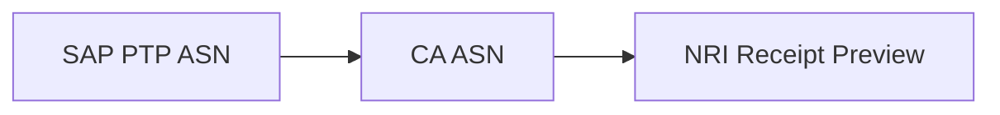
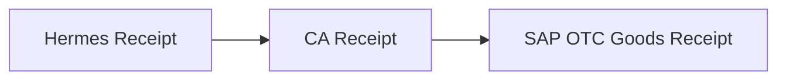
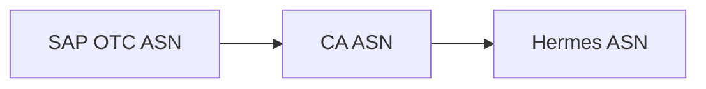
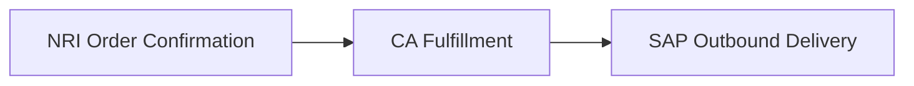
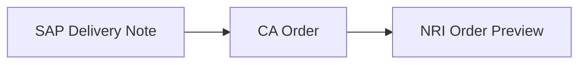
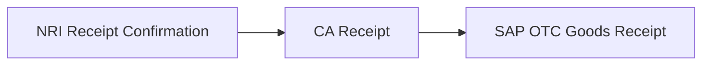
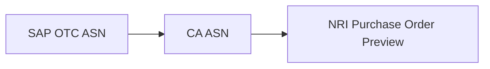
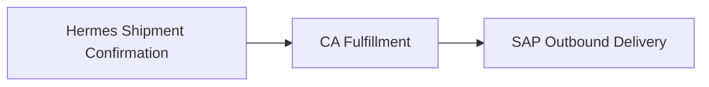
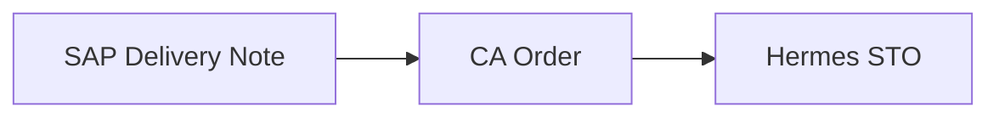

# Scope

## All Deliverables

### Interfaces

| Flow                                                      | Deliverable                                | Type            | Assigned     | Informed     | Reference                                                                  | Completed? |
| --------------------------------------------------------- | ------------------------------------------ | --------------- | ------------ | ------------ | -------------------------------------------------------------------------- | ---------- |
| 1.53 - Nightly Warehouse Inventory from CA to SAP S/4 US  | Access to AWS S3 to upload inventory files | `File Transfer` | `Rothy's`    | `CA`         | [Exporting Inventory Snapshots](inventory-exports/README.md#snapshot)      | x          |
| 1.54 - Intraday POS Inventory from CA to SAP S/4 US       | Access to AWS S3 to upload inventory files | `File Transfer` | `Rothy's`    | `CA`         | [Exporting Inventory Adjustments](inventory-exports/README.md#adjustments) | x          |
| 1.55 - Intraday Warehouse Inventory from CA to SAP S/4 US | Access to AWS S3 to upload inventory files | `File Transfer` | `Rothy's`    | `CA`         | [Exporting Inventory Adjustments](inventory-exports/README.md#adjustments) | x          |
| 1.72 - ASN Receipt from CA to SAP S/4 US                  | Endpoint to send OTC ASN Receipt Webhooks  | `Webhook`       | `Boomi`      | `CA`         | [Receipt Confirmation Webhook](webhooks/README.md#receipt-confirmation)    |            |
| 1.71 - ASN from SAP S/4 US to CA                          | API to create OTC ASN in CA                | `API`           | `CA`         | `Boomi`      | [Sending Advanced Ship Notice](api/README.md#advanced-ship-notice)         | x          |
| 1.79 - ASN Receipt from CA to SAP S/4 US                  | Endpoint to send PTP ASN Receipt Webhooks  | `Webhook`       | `Boomi`      | `CA`         | [Receipt Confirmation Webhook](webhooks/README.md#receipt-confirmation)    | x          |
| 1.80 - ASN from SAP S/4 US to CA                          | API to create PTP ASN in CA                | `API`           | `CA`         | `Boomi`      | [Sending Advanced Ship Notice](api/README.md#advanced-ship-notice)         | x          |
| 1.74 - STO Fulfillment from CA to SAP S/4 US              | API to get STO Fulfillment from CA         | `API`           | `CA`         | `Boomi`      | [Querying Fulfillments](api/README.md#query-fulfillments)                  | x          |
| 1.73 - STO from SAP S/4 US to CA                          | API to create STO in CA                    | `API`           | `CA`         | `Boomi`      | [Creating a Stock Transfer Order](api/README.md#stock-transfer-orders)     | x          |
| 1.76 - ASN Receipt from Store to CA                       | API to create OTC ASN Receipt in CA        | `API`           | `CA`         | `Half Helix` | [Confirming Receipt](api/README.md#receipts)                               | x          |
| 1.75 - ASN from CA to Store                               | Endpoint to send OTC ASN Webhooks          | `Webhook`       | `Half Helix` | `CA`         | [Advanced Ship Notice Webhook](webhooks/README.md#advanced-ship-notice)    |            |
| 1.78 - STO Fulfillment from Store to CA                   | API to create STO Fulfillment in CA        | `API`           | `CA`         | `Half Helix` | [Fulfilling Stock Transfer Orders](api/README.md#create-fulfillment)       | x          |
| 1.77 - STO from CA to Store                               | Endpoint to send STO Webhooks              | `Webhook`       | `Half Helix` | `CA`         | [Stock Transfer Order Webhook](webhooks/README.md#stock-transfer-order)    |            |

### Data

|     | Deliverable                             | Assigned     | Informed     | Flows  | Hermes Epic          | Status                                                                          | Completed? |
| --- | --------------------------------------- | ------------ | ------------ | ------ | -------------------- | ------------------------------------------------------------------------------- | ---------- |
|     | SAP OTC Goods Receipt Requirements      | `Boomi`      | `CA`         | `1.72` |                      |                 |            |
|     | OTC ASN Receipt Webhook Payload         | `CA`         | `Boomi`      | `1.72` |                      |  |            |
|     | Create OTC ASN Receipt Payload          | `CA`         | `Half Helix` | `1.76` | `Inbound Shipments`  |                 |            |
|     | SAP PTP Goods Receipt Requirements      | `Boomi`      | `CA`         | `1.79` |                      |                |            |
|     | PTP ASN Receipt Webhook Payload         | `CA`         | `Boomi`      | `1.80` |                      |  |            |
|     | NRI Purchase Order Preview Requirements | `NRI`        | `CA`         | `1.79` |                      |               |            |
|     | SAP OTC ASN Requirements                | `Boomi`      | `CA`         | `1.71` |                      |                |            |
|     | Hermes OTC ASN Requirements             | `Half Helix` | `CA`         | `1.75` | `Inbound Shipments`  |                |            |
|     | Create OTC ASN Payload                  | `CA`         | `Boomi`      | `1.71` |                      |                 |            |
|     | SAP PTP ASN Requirements                | `Boomi`      | `CA`         | `1.79` |                      |                 |            |
|     | Create PTP ASN Payload                  | `CA`         | `Boomi`      | `1.79` |                      |  |            |
|     | OTC ASN Webhook Payload                 | `CA`         | `Half Helix` | `1.75` | `Inbound Shipments`  |                 |            |
|     | SAP Outbound Delivery Requirements      | `Boomi`      | `CA`         | `1.74` |                      |               |            |
|     | Example Fulfillment Response            | `CA`         | `Boomi`      | `1.74` |                      |               |            |
|     | SAP Delivery Note Requirements          | `Boomi`      | `CA`         | `1.73` |                      |               |            |
|     | Create Order Payload                    | `CA`         | `Boomi`      | `1.73` |                      |               |            |
|     | SAP Outbound Delivery Requirements      | `Boomi`      | `CA`         | `1.74` |                      |               |            |
|     | Example Fulfillment Response            | `CA`         | `Boomi`      | `1.74` |                      |               |            |
|     | Shipment Confirmation Webhook Payload   | `CA`         | `Half Helix` | `1.78` | `Outbound Shipments` |               |            |
|     | NRI Order Preview Requirements          | `CA`         | `Boomi`      | `1.73` |                      |               |            |
|     | Hermes STO Requirements                 | `Half Helix` | `CA`         | `1.77` | `Outbound Shipments` |               |            |
|     | SAP Delivery Note Requirements          | `Boomi`      | `CA`         | `1.73` |                      |               |            |
|     | Create Stock Transfer Order Payload     | `CA`         | `Boomi`      | `1.73` |                      |               |            |

## NRI Receipt Preview API Integration

NRI's Receipt Preview API is used to communicate carton level information and the carton's GS1-128 label to the warehouse so that the contents of the carton will be received automatically simply by scanning the carton label.

### Factory to Warehouse

#### Advanced Ship Notice

##### Dataflow

##### Deliverables

|     | Deliverable                        | Assigned | Informed | Flow   | Hermes Epic | Status                                                                          |
| --- | ---------------------------------- | -------- | -------- | ------ | ----------- | ------------------------------------------------------------------------------- |
| 1   | SAP PTP Goods Receipt Requirements | `Boomi`  | `CA`     | `1.79` |             |                |
| 2   | ASN Receipt Webhook Payload        | `CA`     | `Boomi`  | `1.80` |             |  |
| 3   | NRI Integration Requirements       | `NRI`    | `CA`     | `1.79` |             |               |
| 4   | SAP PTP ASN Requirements           | `Boomi`  | `CA`     | `1.79` |             |                 |
| 5   | Create ASN Payload                 | `CA`     | `Boomi`  | `1.79` |             |  |
| 6   | Create ASN API                     | `CA`     | `Boomi`  | `1.79` |             |               |
| 7   | ASN Receipt Webhook Endpoint       | `Boomi`  | `CA`     | `1.80` |             |                 |

## Store STOs and ASNs

Physically transfer goods between Retail Stores and Warehouse.

### Warehouse to Store

#### Receipt Confirmation

##### Dataflow

##### Deliverables

|     | Deliverable                        | Assigned | Informed     | Olympus Flow | Hermes Epic         | Status                                                             |
| --- | ---------------------------------- | -------- | ------------ | ------------ | ------------------- | ------------------------------------------------------------------ |
| 1   | SAP OTC Goods Receipt Requirements | `Boomi`  | `CA`         | `1.72`       |                     |    |
| 2   | Create ASN Receipt Payload         | `CA`     | `Half Helix` | `1.76`       | `Inbound Shipments` |    |
| 3   | Create ASN Receipt API             | `CA`     | `Half Helix` | `1.76`       | `Inbound Shipments` |  |
| 4   | ASN Receipt Webhook Endpoint       | `Boomi`  | `CA`         | `1.72`       |                     |    |

#### Advanced Ship Notice

##### Dataflow

##### Deliverables

|     | Deliverable              | Assigned     | Informed     | Olympus Flow | Hermes Epic         | Status                                                            |
| --- | ------------------------ | ------------ | ------------ | ------------ | ------------------- | ----------------------------------------------------------------- |
| 1   | Hermes ASN Requirements  | `Half Helix` | `CA`         | `1.75`       | `Inbound Shipments` |  |
| 2   | SAP OTC ASN Requirements | `Boomi`      | `CA`         | `1.75`       |                     |  |
| 3   | ASN Webhook Payload      | `CA`         | `Half Helix` | `1.75`       | `Inbound Shipments` |   |
| 4   | Create ASN Payload       | `CA`         | `Boomi`      | `1.71`       |                     |   |
| 5   | ASN Webhook Endpoint     | `Half Helix` | `CA`         | `1.75`       | `Inbound Shipments` |   |
| 6   | Create ASN API           | `CA`         | `Boomi`      | `1.71`       |                     |   |

#### Ship Confirmation

##### Changes

| Status                                                           | Change                                       | Reason                                                           |
| ---------------------------------------------------------------- | -------------------------------------------- | ---------------------------------------------------------------- |
|  | Map LicensePlate from NRI Order Confirmation | This number is printed on the carton labels for Retail Shipments |

##### Dataflow

##### Deliverables

|     | Deliverable                        | Assigned | Informed | Olympus Flow | Hermes Epic | Status                                                             |
| --- | ---------------------------------- | -------- | -------- | ------------ | ----------- | ------------------------------------------------------------------ |
| 1   | SAP Outbound Delivery Requirements | `Boomi`  | `CA`     | `1.74`       |             |  |
| 2   | Example Fulfillment Response       | `CA`     | `Boomi`  | `1.74`       |             |  |
| 3   | Get Order API                      | `CA`     | `Boomi`  | `1.74`       |             |  |

#### Stock Transfer Order

##### Dataflow

##### Deliverables

| #   | Deliverable                    | Assigned | Informed | Olympus Flow | Hermes Epic | Status                                                             |
| --- | ------------------------------ | -------- | -------- | ------------ | ----------- | ------------------------------------------------------------------ |
| 1   | SAP Delivery Note Requirements | `Boomi`  | `CA`     | `1.73`       |             |  |
| 2   | Create Order Payload           | `CA`     | `Boomi`  | `1.73`       |             |  |
| 3   | Create Order API               | `CA`     | `Boomi`  | `1.73`       |             |  |

### Store to Warehouse

#### Receipt Confirmation

##### Dataflow

##### Deliverables

|     | Deliverable                        | Assigned | Informed | Olympus Flow | Hermes Epic | Status                                                           |
| --- | ---------------------------------- | -------- | -------- | ------------ | ----------- | ---------------------------------------------------------------- |
| 1   | SAP OTC Goods Receipt Requirements | `Boomi`  | `CA`     | `1.72`       |             |  |
| 2   | ASN Receipt Webhook Endpoint       | `Boomi`  | `CA`     | `1.72`       |             |  |

#### Advanced Ship Notice

##### Dataflow

##### Deliverables

|     | Deliverable              | Assigned | Informed | Olympus Flow | Hermes Epic | Status                                                            |
| --- | ------------------------ | -------- | -------- | ------------ | ----------- | ----------------------------------------------------------------- |
| 1   | SAP OTC ASN Requirements | `Boomi`  | `CA`     | `1.71`       |             |  |
| 2   | Create ASN Payload       | `CA`     | `Boomi`  | `1.71`       |             |   |
| 3   | Create ASN API           | `CA`     | `Boomi`  | `1.71`       |             |   |

#### Ship Confirmation

##### Dataflow

##### Deliverables

|     | Deliverable                           | Assigned | Informed     | Olympus Flow | Hermes Epic          | Status                                                             |
| --- | ------------------------------------- | -------- | ------------ | ------------ | -------------------- | ------------------------------------------------------------------ |
| 1   | SAP Outbound Delivery Requirements    | `Boomi`  | `CA`         | `1.74`       |                      |  |
| 2   | Example Fulfillment Response          | `CA`     | `Boomi`      | `1.74`       |                      |  |
| 3   | Shipment Confirmation Webhook Payload | `CA`     | `Half Helix` | `1.78`       | `Outbound Shipments` |  |
| 4   | Shipment Confirmation API             | `CA`     | `Half Helix` | `1.78`       | `Outbound Shipments` |  |
| 5   | Get Order API                         | `CA`     | `Boomi`      | `1.74`       |                      |  |

#### Stock Transfer Order

##### Dataflow

##### Deliverables

| #   | Deliverable                    | Assigned     | Informed | Olympus Flow | Hermes Epic          | Status                                                             |
| --- | ------------------------------ | ------------ | -------- | ------------ | -------------------- | ------------------------------------------------------------------ |
| 1   | Hermes STO Requirements        | `Half Helix` | `CA`     | `1.77`       | `Outbound Shipments` |  |
| 2   | SAP Delivery Note Requirements | `Boomi`      | `CA`     | `1.73`       |                      |  |
| 3   | Create Order Payload           | `CA`         | `Boomi`  | `1.73`       |                      |  |
| 4   | Create Order API               | `CA`         | `Boomi`  | `1.73`       |                      |  |

## One-way sync for intraday updates from Shopify to ChannelApe for POS locations

## True Up Inventory with Shopify using select Shopify locations as system of record

## Synchronize ChannelApe Order Status with Shopify

## NRI Inventory Transfers for two-sided SAP Inventory Adjustments

### Changes

| Status                                                           | Change                                                                                                | Reason                                                                           |
| ---------------------------------------------------------------- | ----------------------------------------------------------------------------------------------------- | -------------------------------------------------------------------------------- |
|  | Process adjustments in individual batches                                                             | To enable inventory transfer grouping by batch ID                                |
|  | Process adjustments "TRANSFER" adjustments referencing the other's AdjustmentNumber in the same batch | To group inventory transfers by batch ID and enable two-sided adjustments in SAP |
