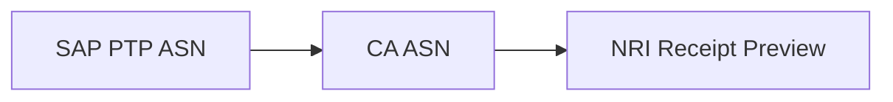
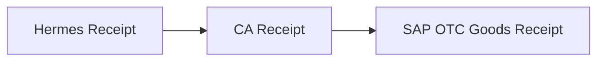
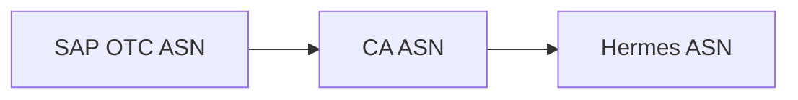
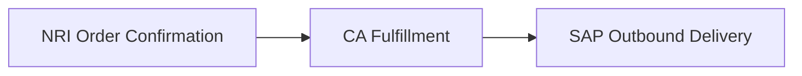
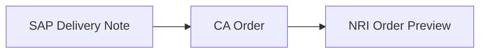
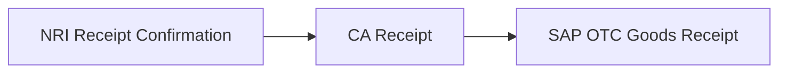
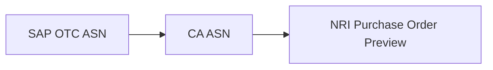
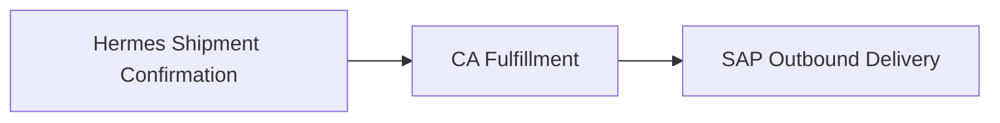
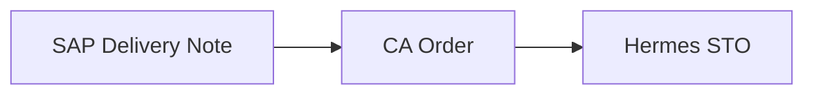

# Scope

## All Deliverables

### Interfaces

| Flow                                                      | Deliverable                                | Type            | Assigned     | Informed     | Reference                                                                  | Completed? |
| --------------------------------------------------------- | ------------------------------------------ | --------------- | ------------ | ------------ | -------------------------------------------------------------------------- | ---------- |
| 1.53 - Nightly Warehouse Inventory from CA to SAP S/4 US  | Access to AWS S3 to upload inventory files | `File Transfer` | `Rothy's`    | `CA`         | [Exporting Inventory Snapshots](inventory-exports/README.md#snapshot)      | x          |
| 1.54 - Intraday POS Inventory from CA to SAP S/4 US       | Access to AWS S3 to upload inventory files | `File Transfer` | `Rothy's`    | `CA`         | [Exporting Inventory Adjustments](inventory-exports/README.md#adjustments) | x          |
| 1.55 - Intraday Warehouse Inventory from CA to SAP S/4 US | Access to AWS S3 to upload inventory files | `File Transfer` | `Rothy's`    | `CA`         | [Exporting Inventory Adjustments](inventory-exports/README.md#adjustments) | x          |
| 1.72 - ASN Receipt from CA to SAP S/4 US                  | Endpoint to send OTC ASN Receipt Webhooks  | `Webhook`       | `Boomi`      | `CA`         | [Receipt Confirmation Webhook](webhooks/README.md#receipt-confirmation)    |            |
| 1.71 - ASN from SAP S/4 US to CA                          | API to create OTC ASN in CA                | `API`           | `CA`         | `Boomi`      | [Sending Advanced Ship Notice](api/README.md#advanced-ship-notice)         | x          |
| 1.79 - ASN Receipt from CA to SAP S/4 US                  | Endpoint to send PTP ASN Receipt Webhooks  | `Webhook`       | `Boomi`      | `CA`         | [Receipt Confirmation Webhook](webhooks/README.md#receipt-confirmation)    | x          |
| 1.80 - ASN from SAP S/4 US to CA                          | API to create PTP ASN in CA                | `API`           | `CA`         | `Boomi`      | [Sending Advanced Ship Notice](api/README.md#advanced-ship-notice)         | x          |
| 1.74 - STO Fulfillment from CA to SAP S/4 US              | API to get STO Fulfillment from CA         | `API`           | `CA`         | `Boomi`      | [Querying Fulfillments](api/README.md#query-fulfillments)                  | x          |
| 1.73 - STO from SAP S/4 US to CA                          | API to create STO in CA                    | `API`           | `CA`         | `Boomi`      | [Creating a Stock Transfer Order](api/README.md#stock-transfer-orders)     | x          |
| 1.76 - ASN Receipt from Store to CA                       | API to create OTC ASN Receipt in CA        | `API`           | `CA`         | `Half Helix` | [Confirming Receipt](api/README.md#receipts)                               | x          |
| 1.75 - ASN from CA to Store                               | Endpoint to send OTC ASN Webhooks          | `Webhook`       | `Half Helix` | `CA`         | [Advanced Ship Notice Webhook](webhooks/README.md#advanced-ship-notice)    |            |
| 1.78 - STO Fulfillment from Store to CA                   | API to create STO Fulfillment in CA        | `API`           | `CA`         | `Half Helix` | [Fulfilling Stock Transfer Orders](api/README.md#create-fulfillment)       | x          |
| 1.77 - STO from CA to Store                               | Endpoint to send STO Webhooks              | `Webhook`       | `Half Helix` | `CA`         | [Stock Transfer Order Webhook](webhooks/README.md#stock-transfer-order)    |            |

### Data

#### Status Legend

| Status      | Description                                       |
| ----------- | ------------------------------------------------- |
| NEW         | Added scope that was previously unidentified.     |
| TODO        | Known scope that needs to be completed.           |
| IN PROGRESS | Delivery in progress.                             |
| IN REVISION | Previously completed but IN REVISION for changes. |
| DONE        | Completed.                                        |
| CLOSED      | Not completed but no longer needed.               |

#### Deliverables

|     | Deliverable                        | Assigned     | Informed     | Flows          | Hermes Epic          | Status      | Blocked By |
| --- | ---------------------------------- | ------------ | ------------ | -------------- | -------------------- | ----------- | ---------- |
| 1   | SAP OTC Goods Receipt Requirements | `Boomi`      | `CA`         | `1.72`         |                      | IN PROGRESS |            |
| 2   | OTC ASN Receipt Webhook Payload    | `CA`         | `Boomi`      | `1.72`         |                      | IN REVISION | 1          |
| 3   | Create OTC ASN Receipt Payload     | `CA`         | `Half Helix` | `1.76`         | `Inbound Shipments`  | TODO        | 1          |
| 4   | SAP PTP Goods Receipt Requirements | `Boomi`      | `CA`         | `1.79`         |                      | DONE        |            |
| 5   | PTP ASN Receipt Webhook Payload    | `CA`         | `Boomi`      | `1.80`         |                      | CLOSED      |            |
| 6   | NRI Receipt Preview Requirements   | `NRI`        | `CA`         | `1.79`         |                      | DONE        |            |
| 7   | SAP OTC ASN Requirements           | `Boomi`      | `CA`         | `1.71`         |                      | IN PROGRESS |            |
| 8   | Hermes OTC ASN Requirements        | `Half Helix` | `CA`         | `1.75`         | `Inbound Shipments`  | IN PROGRESS |            |
| 9   | Create OTC ASN Payload             | `CA`         | `Boomi`      | `1.71`         |                      | TODO        | 1, 7       |
| 10  | SAP PTP ASN Requirements           | `Boomi`      | `CA`         | `1.79`         |                      | CLOSED      |            |
| 11  | Create PTP ASN Payload             | `CA`         | `Boomi`      | `1.79`         |                      | CLOSED      |            |
| 12  | OTC ASN Webhook Payload            | `CA`         | `Half Helix` | `1.75`         | `Inbound Shipments`  | IN REVISION | 9          |
| 13  | SAP Outbound Delivery Requirements | `Boomi`      | `CA`         | `1.74`, `1.73` | `Outbound Shipments` | IN PROGRESS |            |
| 14  | Example Fulfillment Response       | `CA`         | `Boomi`      | `1.74`         |                      | DONE        |            |
| 15  | SAP Delivery Note Requirements     | `Boomi`      | `CA`         | `1.73`, `1.77` | `Outbound Shipments` | IN PROGRESS |            |
| 16  |                                    |              |              |                |                      |             |            |
| 17  | Shipment Confirmation Payload      | `CA`         | `Half Helix` | `1.78`         | `Outbound Shipments` | DONE        |            |
| 18  | NRI Order Preview Requirements     | `CA`         | `Boomi`      | `1.73`         |                      | DONE        |            |
| 19  | Hermes STO Requirements            | `Half Helix` | `CA`         | `1.77`         | `Outbound Shipments` | TODO        | 13, 15     |
| 20  | Create STO Payload                 | `CA`         | `Boomi`      | `1.73`, `1.77` | `Outbound Shipments` | IN REVISION | 15         |

## NRI Receipt Preview API Integration

NRI's Receipt Preview API is used to communicate carton level information and the carton's GS1-128 label to the warehouse so that the contents of the carton will be received automatically simply by scanning the carton label.

### Factory to Warehouse

#### Advanced Ship Notice

##### Dataflow

##### Deliverables

|     | Deliverable                        | Assigned | Informed | Flow   | Hermes Epic | Status      |
| --- | ---------------------------------- | -------- | -------- | ------ | ----------- | ----------- |
| 1   | SAP PTP Goods Receipt Requirements | `Boomi`  | `CA`     | `1.79` |             | NEW         |
| 2   | ASN Receipt Webhook Payload        | `CA`     | `Boomi`  | `1.80` |             | IN REVISION |
| 3   | NRI Integration Requirements       | `NRI`    | `CA`     | `1.79` |             | DONE        |
| 4   | SAP PTP ASN Requirements           | `Boomi`  | `CA`     | `1.79` |             | TODO        |
| 5   | Create ASN Payload                 | `CA`     | `Boomi`  | `1.79` |             | IN REVISION |
| 6   | Create ASN API                     | `CA`     | `Boomi`  | `1.79` |             | DONE        |
| 7   | ASN Receipt Webhook Endpoint       | `Boomi`  | `CA`     | `1.80` |             | TODO        |

## Store STOs and ASNs

Physically transfer goods between Retail Stores and Warehouse.

### Warehouse to Store

#### Receipt Confirmation

##### Dataflow

##### Deliverables

|     | Deliverable | Assigned | Informed | Olympus Flow | Hermes Epic | Status |
| --- | ----------- | -------- | -------- | ------------ | ----------- | ------ |

#### Advanced Ship Notice

##### Dataflow

##### Deliverables

|     | Deliverable | Assigned | Informed | Olympus Flow | Hermes Epic | Status |
| --- | ----------- | -------- | -------- | ------------ | ----------- | ------ |

#### Ship Confirmation

##### Changes

| Status | Change | Reason |
| ------ | ------ | ------ |

##### Dataflow

##### Deliverables

|     | Deliverable | Assigned | Informed | Olympus Flow | Hermes Epic | Status |
| --- | ----------- | -------- | -------- | ------------ | ----------- | ------ |

#### Stock Transfer Order

##### Dataflow

##### Deliverables

| #   | Deliverable | Assigned | Informed | Olympus Flow | Hermes Epic | Status |
| --- | ----------- | -------- | -------- | ------------ | ----------- | ------ |

### Store to Warehouse

#### Receipt Confirmation

##### Dataflow

##### Deliverables

|     | Deliverable | Assigned | Informed | Olympus Flow | Hermes Epic | Status |
| --- | ----------- | -------- | -------- | ------------ | ----------- | ------ |

#### Advanced Ship Notice

##### Dataflow

##### Deliverables

|     | Deliverable | Assigned | Informed | Olympus Flow | Hermes Epic | Status |
| --- | ----------- | -------- | -------- | ------------ | ----------- | ------ |

#### Ship Confirmation

##### Dataflow

##### Deliverables

|     | Deliverable | Assigned | Informed | Olympus Flow | Hermes Epic | Status |
| --- | ----------- | -------- | -------- | ------------ | ----------- | ------ |

#### Stock Transfer Order

##### Dataflow

##### Deliverables

| #   | Deliverable | Assigned | Informed | Olympus Flow | Hermes Epic | Status |
| --- | ----------- | -------- | -------- | ------------ | ----------- | ------ |

## One-way sync for intraday updates from Shopify to ChannelApe for POS locations

## True Up Inventory with Shopify using select Shopify locations as system of record

## Synchronize ChannelApe Order Status with Shopify

## NRI Inventory Transfers for two-sided SAP Inventory Adjustments

### Changes

| Status | Change                                                                                                | Reason                                                                           |
| ------ | ----------------------------------------------------------------------------------------------------- | -------------------------------------------------------------------------------- |
| TODO   | Process adjustments in individual batches                                                             | To enable inventory transfer grouping by batch ID                                |
| TODO   | Process adjustments "TRANSFER" adjustments referencing the other's AdjustmentNumber in the same batch | To group inventory transfers by batch ID and enable two-sided adjustments in SAP |
