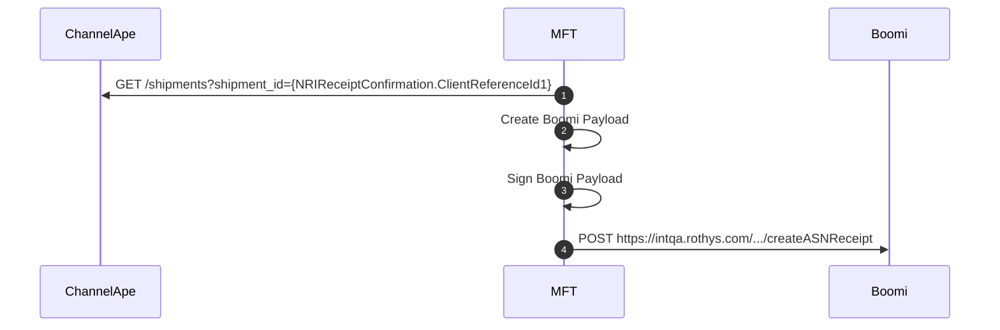
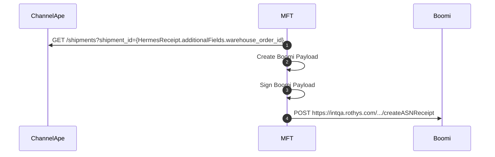

### Create Warehouse Receipt

Implies the Receipt Confirmation is present in and started this process from MFT.

### Create Store Receipt

Implies the Receipt Confirmation is present in and started this process from MFT.

