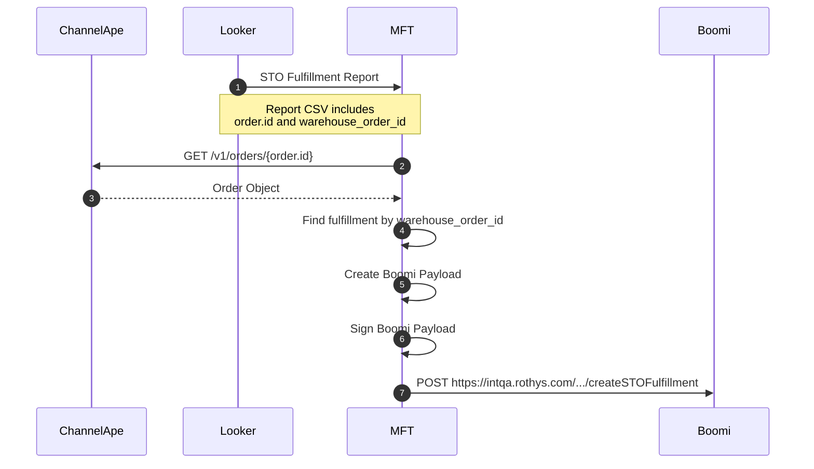

### Send STO Fulfillments to Boomi

```mermaid
sequenceDiagram
    autonumber
    participant ChannelApe
    participant Looker
    participant MFT
    participant Boomi

    Looker->>MFT: STO Fulfillment Report
    note over Looker,MFT: Report CSV includes <br />order.id and warehouse_order_id
    MFT->>ChannelApe: GET /v1/orders/{order.id}
    ChannelApe-->>MFT: Order Object
    MFT->>MFT: Find fulfillment by warehouse_order_id
    MFT->>MFT: Create Boomi Payload
    MFT->>MFT: Sign Boomi Payload
    MFT->>Boomi: POST https://intqa.rothys.com/.../createSTOFulfillment
```