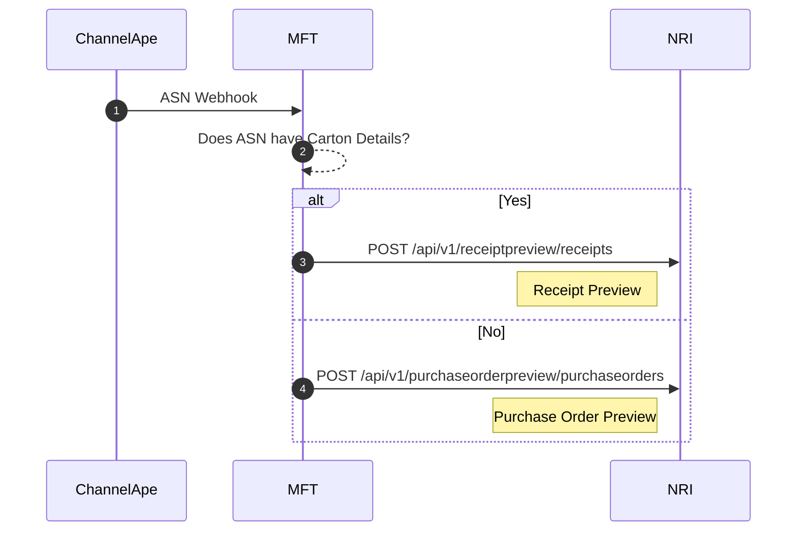
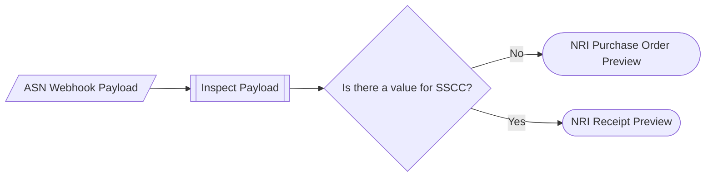

## Sending Advanced Ship Notice to NRI

ChannelApe will send the ASN Webhook to our MFT instance where the following will occur:
1. Choose the NRI API
1. Mapping to NRI's spec

### ASN Carton Details Test

An ASN has Carton Details if a value is found in the `SSCC` field in the payload.

