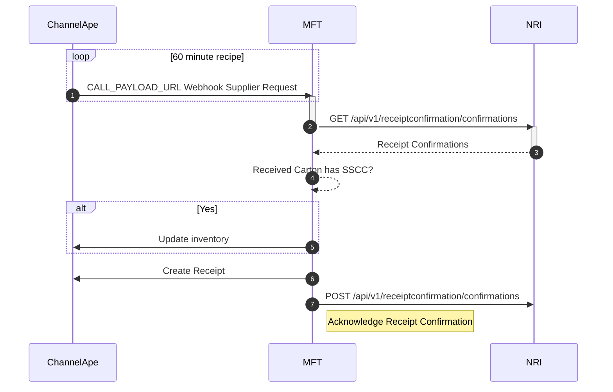

## Receipt Confirmation

NRI publishes Receipt Confirmations to their API where they will remain available to API consumers until acknowledged.

ChannelApe will poll this API every 60 minutes to ingest and acknowledge new Receipt Confirmations.

### SSCC in Received Cartons Test

The Received Carton has an SSCC if the value in `ReceiptCartons[n].Sscc` of the ReceiptConfirmation is not blank.

### Inventory
Inventory will become immediately available upon ingestion if the Cartons Received have an SSCC.
This can't be done for Cartons without an SSCC because only Shipments with Carton Level Details communicated using the Receipt Preview API are instantly received in NRI's system, and the SSCC is the indicator.

ChannelApe cannot rely on dates either because NRI only records the Receipt Completion Date, not the start date and the Arrival Date does not indicate start of the receiving process.
This is done to avoid overinflating inventory.