# Purchase Orders
Purchase orders are used by brands to acquire more inventory from a supplier or manufacturer.

A Purchase Order typically includes:
- Header details
    - Vendor (Manufacturer / Supplier) name
    - Order number
    - Payment terms
- Line item details
    - SKU, quantity, and price
    - Ship-by date
    - Ship-to destination
    - Shipping terms

By using purchase orders, brands can also track their spending and manage their inventory.

## Shipments
Goods are shipped from their origin as soon as shipping terms can be satisfied and it's not uncommong for a single Purchase Order to be fulfilled over multiple shipments.

Each shipment typically includes:
- Header details
    - Purchase Order Number
    - A unique Shipment Number
    - Tracking numbers
    - Destination
    - Estimated arrival date
- Packaging details
    - Container hierarchy
    - Unique numbers for each container
- Line item details
    - Container reference
    - SKU and quantity

## Example
3,000 pairs of shoes are needed by November 1, 2023 according to the production schedule created by the Inventory Planning & Merchandising teams at ABC Co., a footwear & apparel brand.

Facts

- They know a 20 ft. container fits roughtly 3,500 shoes.
- They also know it takes about 2-4 weeks to transport, a delivery of this size will take about 1 week to receive and stock at the Warehouse, and an error rate of 3%.

Steps

1. ABC Co. coordinates a Purchase Order for 3,100 units from their manufacturer in China and a ship-by date of September 15, 2023, with Flexport, their freight forwarding broker.
1. ABC Co. is given Flexport's invoice ID to track delivery progress.
1. The manufacturer loads 10 pallets into the container with each pallet containing ~310 pairs of shoes and the shipment departs for Port of Los Angeles.
1. ABC Co. gives their Warehouse advanced notice of this shipment and its expected arrival date to ensure delivery goes smoothly.

### Opportunities
1. What if this Purchase Order contained a hundred line items and instead of 2 large POs a year, it was actually 20?
1. What if delivery is delayed?
1. How does ABC Co. know how many pairs of shoes a 20 ft. container can fit?
1. Or that it takes 2-4 weeks to transport and another week to put away at the Warehouse?
1. How do they know their shrink rate is 3%?
1. How did they create their production schedule in the first place?

### Other Use Cases
#### Dropshipping
In some circumstances brands can arrange for the Purchase Order to be delivered directly to their customer, otherwise known as dropshipping.
#### SDQ Order
SDQ stands for Ship Destination Quantity.  An SDQ order is a Purchase Order that contains items that have varying ship-by dates and/or varying destinations.

## Purchase Orders - using our API

```mermaid
sequenceDiagram
    autonumber
    participant Manufacturer
    actor ABC Co
    participant ChannelApe API
    actor ChannelApe iPaaS Playbook
    participant ChannelApe IMS
    participant Warehouse

    ABC Co->>Manufacturer: Places order for 3100 units
    ABC Co-->>ChannelApe API: Create Purchase Order
    note right of ChannelApe API: Order status is OPEN
    Manufacturer->>Manufacturer: 🚢 Ships order
    Manufacturer->>ABC Co: Informs buyer of shipment
    ABC Co-->>ChannelApe API: Update Purchase Order with Fulfillment
    note right of ChannelApe API: Fulfillment status is SHIPPED<br/>Order status is IN_PROGRESS
    note right of ChannelApe iPaaS Playbook: Send ASNs runs on<br />⏱️ 15 minute intervals
    ChannelApe iPaaS Playbook->>ChannelApe API: Queries for fulfillments in SHIPPED status on orders with IN_PROGESS status
    activate ChannelApe iPaaS Playbook
    ChannelApe iPaaS Playbook-->>Warehouse: Send Advanced Ship Notice
    ChannelApe iPaaS Playbook-->>ChannelApe IMS: Update inventory
    deactivate ChannelApe iPaaS Playbook
    note right of ChannelApe IMS: +3100 to ON_ORDER<br/>at the Warehouse location
    ChannelApe iPaaS Playbook-->>ChannelApe API: Update fulfillment status on Purchase Order
    note left of ChannelApe API: Fulfillment status is changed to PENDING_RECEIPT
    
    Manufacturer-->>Warehouse:  🚚 Shipment in transit to warehouse
    note right of Warehouse: 📦 Shipment arrives at warehouse
    note right of Warehouse: Receiving process starts
    loop Until receipt finishes (10 more times)
    Warehouse->>Warehouse: Pallet is put away and receipt is created
    Warehouse->>ChannelApe iPaaS Playbook: Send receipt details
    ChannelApe iPaaS Playbook-->>ChannelApe IMS: Update inventory
    note right of ChannelApe IMS: -310 to ON_ORDER<br/>and +310 to AVAILABLE_TO_SELL<br/>at the Warehouse location
    ChannelApe iPaaS Playbook-->>ChannelApe API: Update fulfillment status on Purchase Order
    note left of ChannelApe API: Fulfillment status is changed to RECEIVED
    end
    note right of Warehouse: 🏁 Receipt is finished
    alt are all fulfillments RECEIVED?
    ChannelApe iPaaS Playbook-->>ChannelApe API: Close Purchase Order
    end
```

