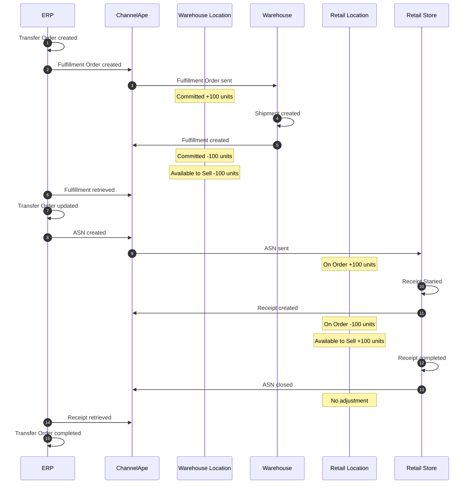
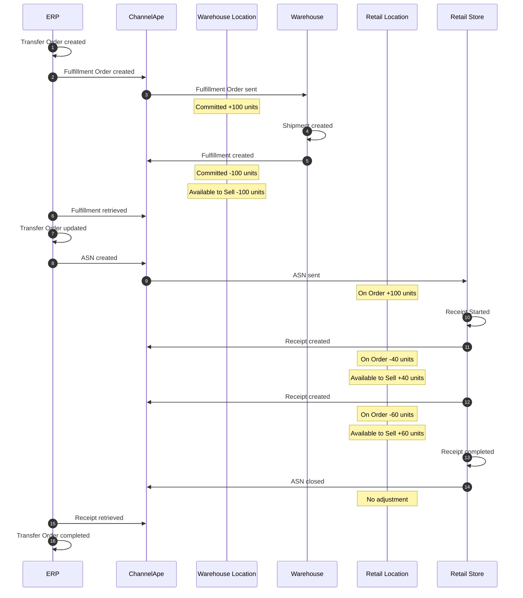
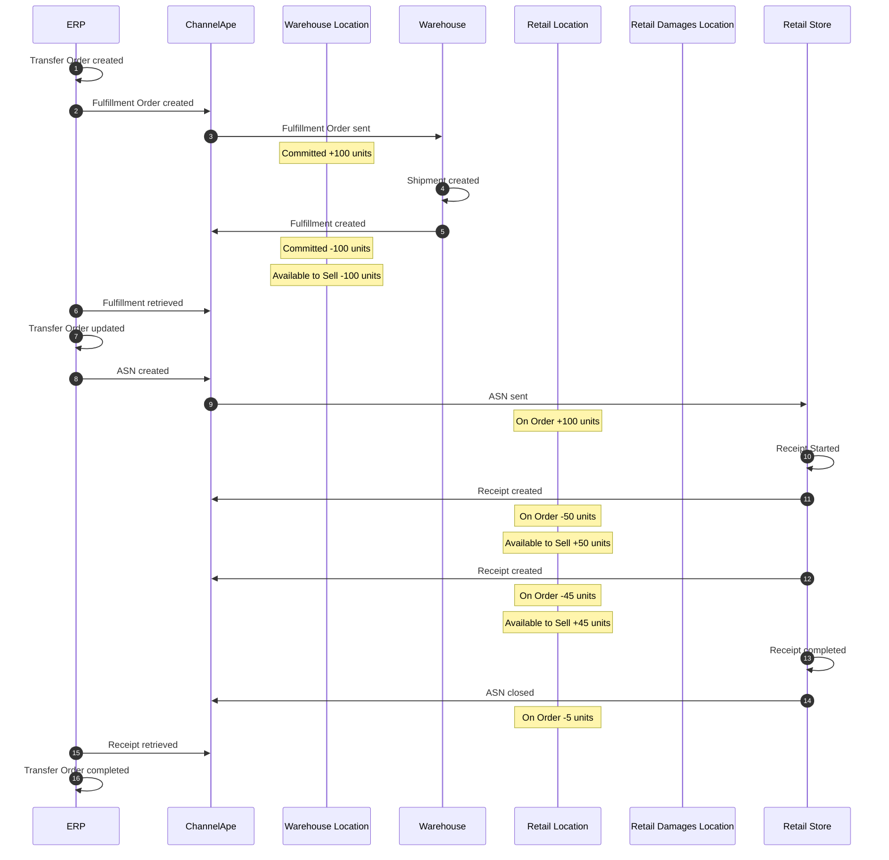
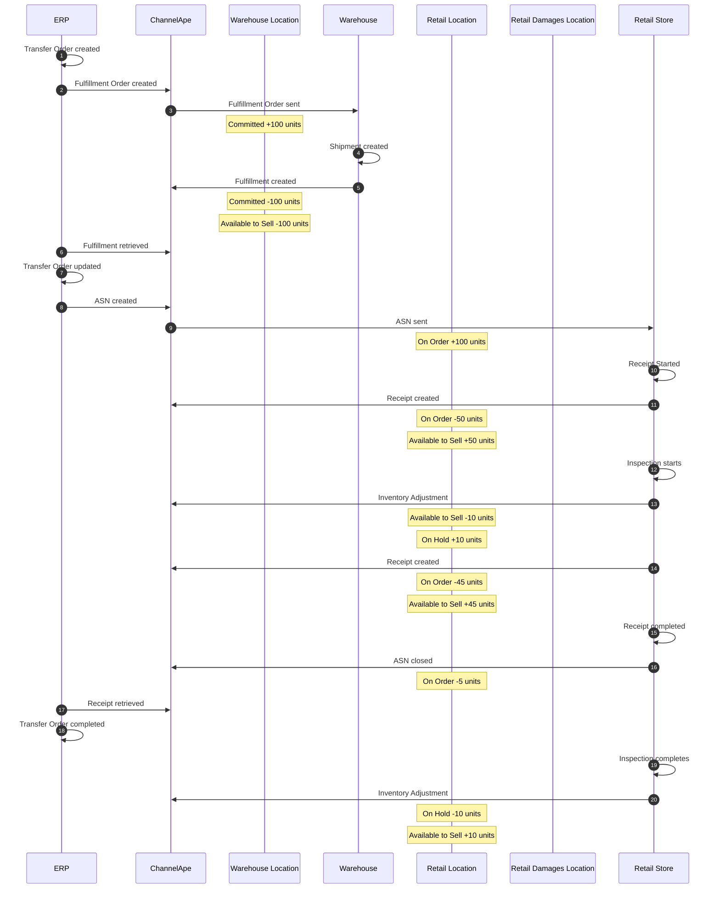
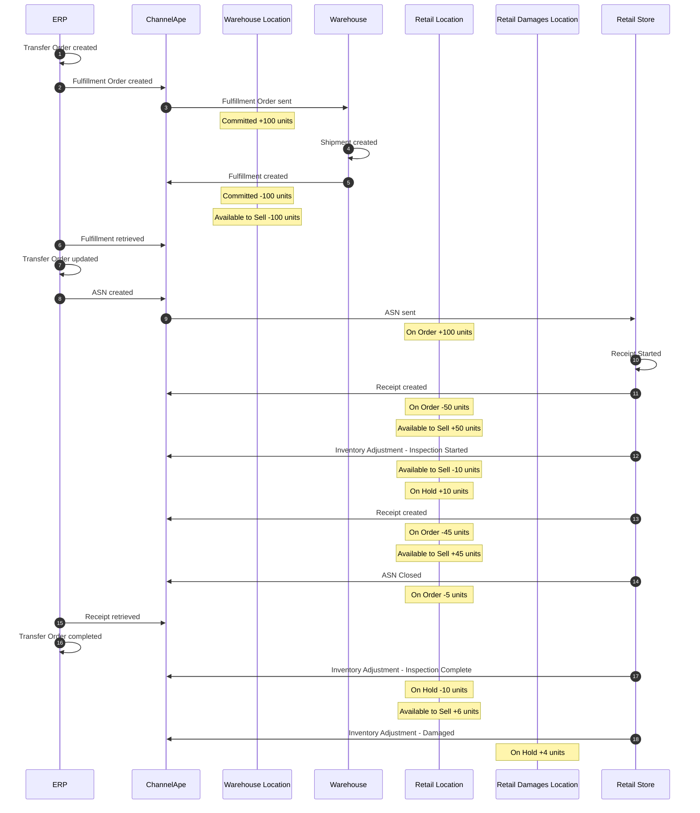
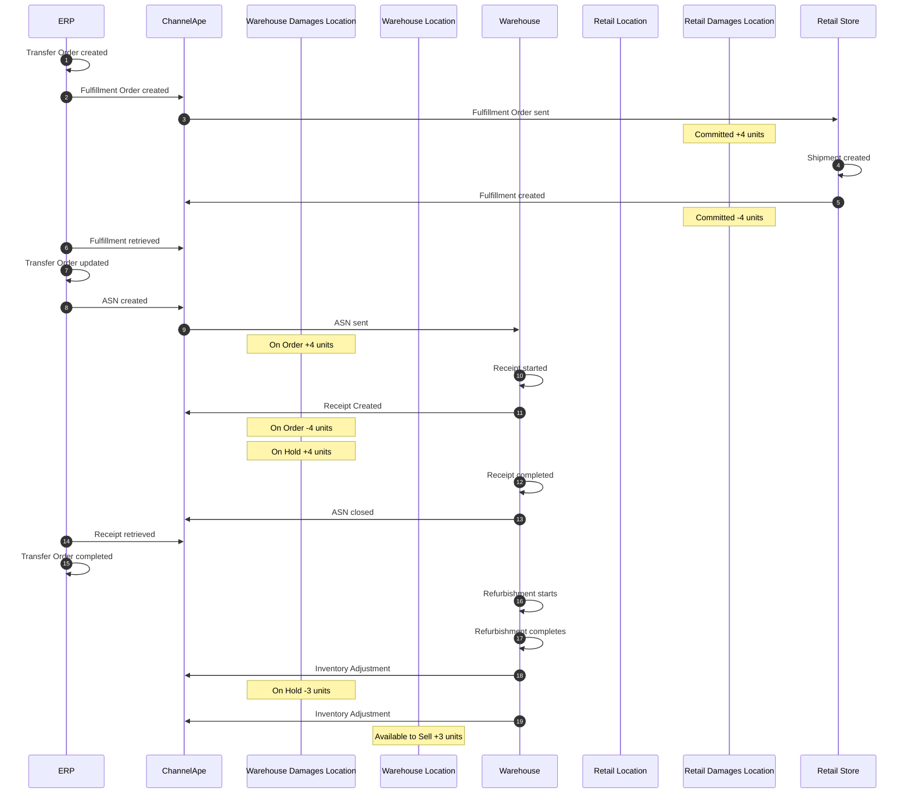

# Transfer Orders
## Warehouse to Retail Store initiated by ERP
### No Partial Receipts, No Short Shipment, No Quality Control, No Damages

In this scenario 100 units are transferred from the warehouse to retail store.

### Partial Receipts, No Short Shipment, No Quality Control, No Damages
In this scenario 100 units are transferred from the warehouse to retail store.

Partial receipts are created as the inventory is received.

### Partial Receipts, Short Shipment, No Quality Control, No Damages
In this scenario 100 units are transferred from the warehouse to retail store.

Partial receipts are created as the inventory is received.

The delivery was short 5 units.

### Partial Receipts, Short Shipment, Quality Control, No Damages
In this scenario 100 units are transferred from the warehouse to retail store.

Partial receipts are created as the inventory is received.

The delivery was short 5 units.

A sample size of 10 units are inspected as part of Quality Control.

10 units pass inspection and are returned to Available stock.

### Partial Receipts, Short Shipment, Quality Control, Damages

In this scenario 100 units are transferred from the warehouse to retail store.

Partial receipts are created as the inventory is received.

The delivery was short 5 units.

A sample size of 10 units are inspected as part of Quality Control.

6 units pass inspection and are returned to Available stock.

4 units fail inspection and are transferred to damages.

## Damages to Warehouse initiated by ERP
### Some of the damages are refurbished

In this scenario 4 units are transferred from the retail store to the warehouse for refurbishment.

3 units are refurbished and returned to Available stock.

1 unit remains in damages.

