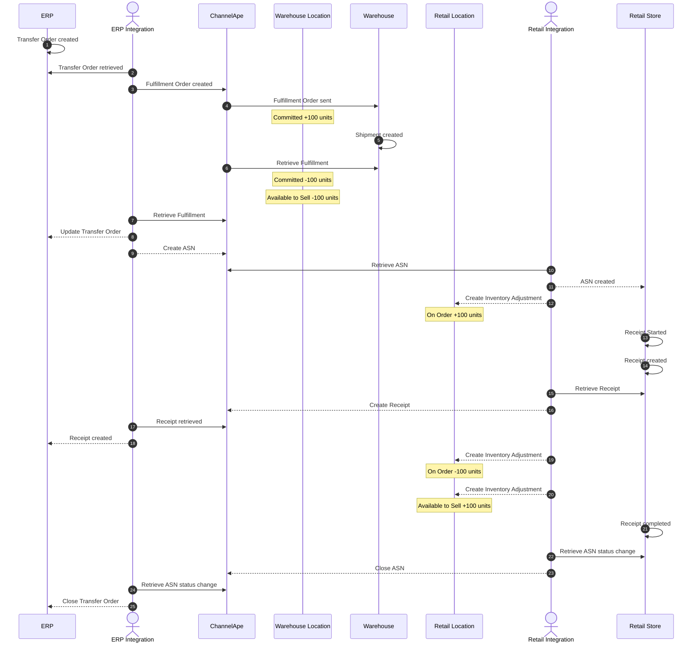
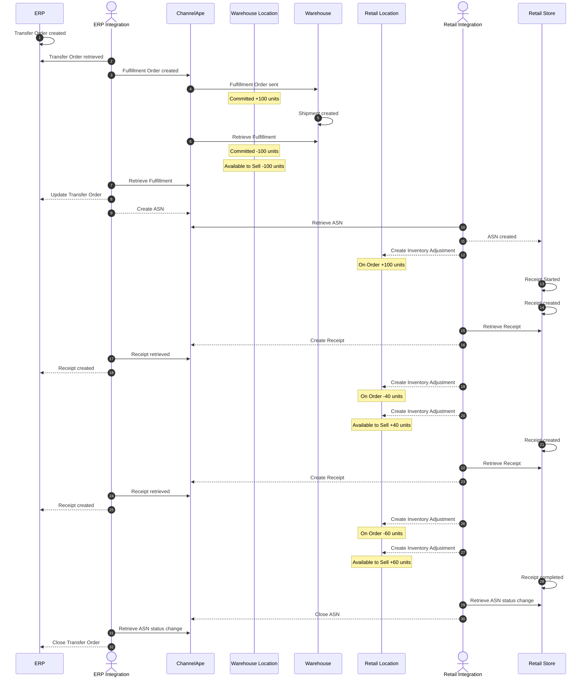
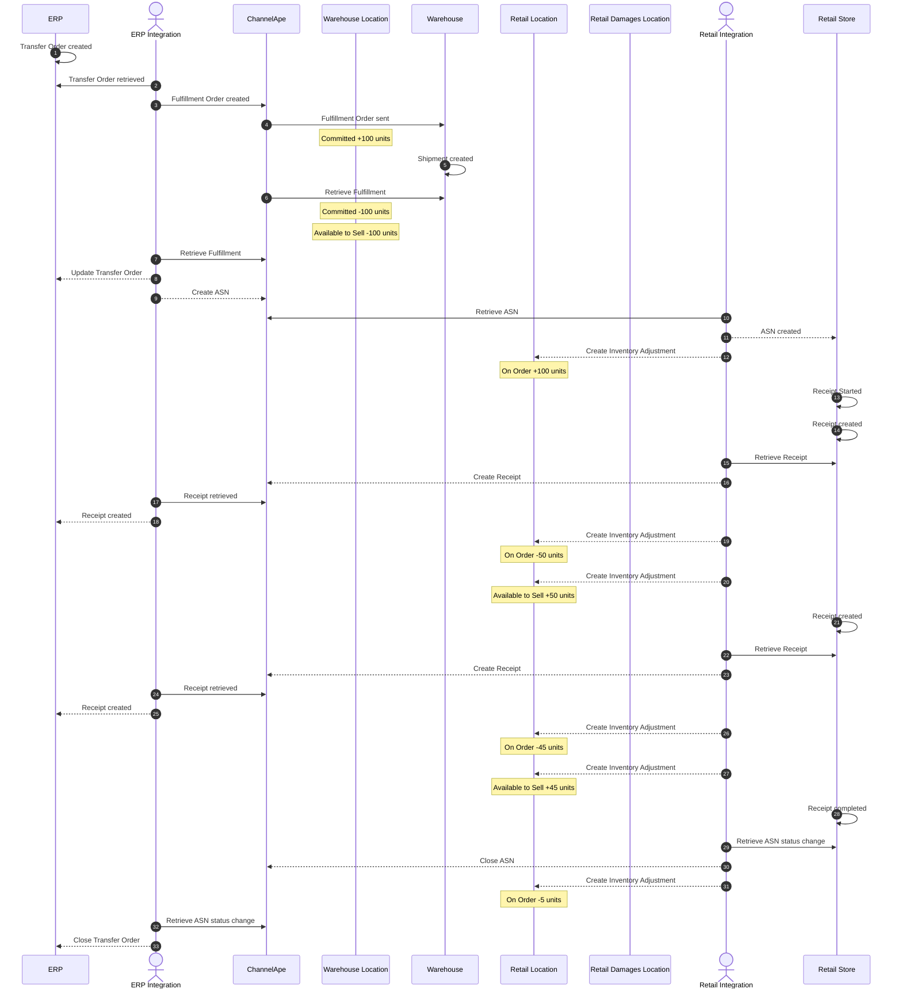
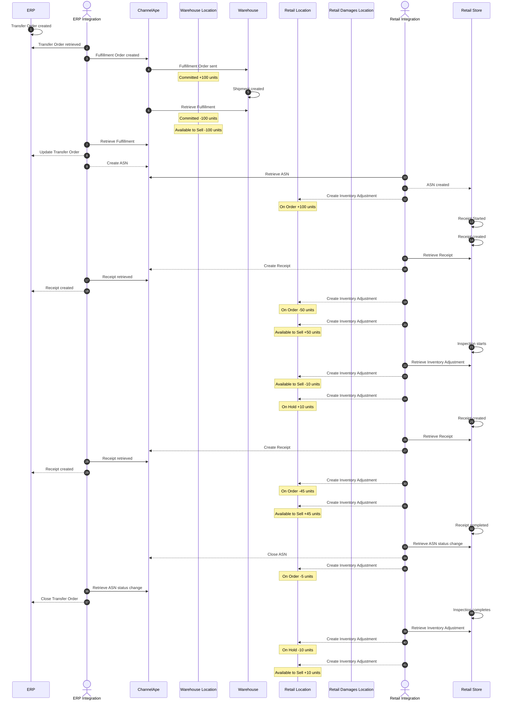
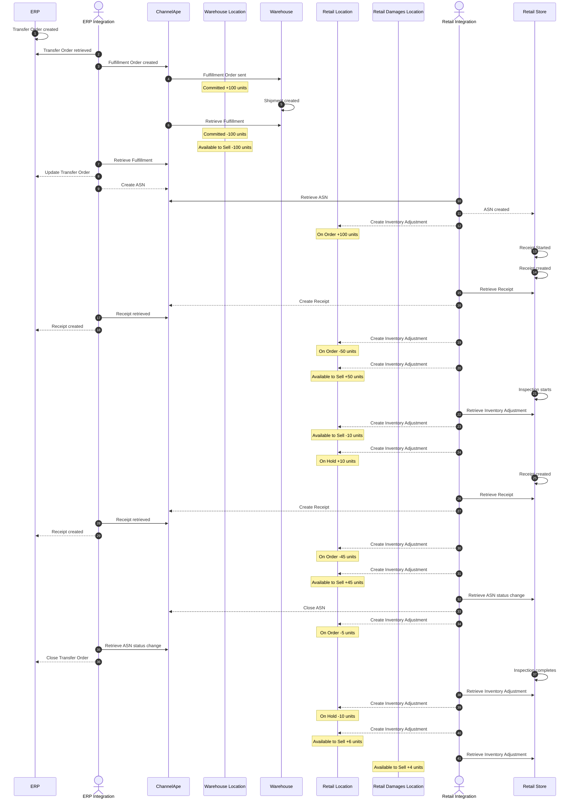
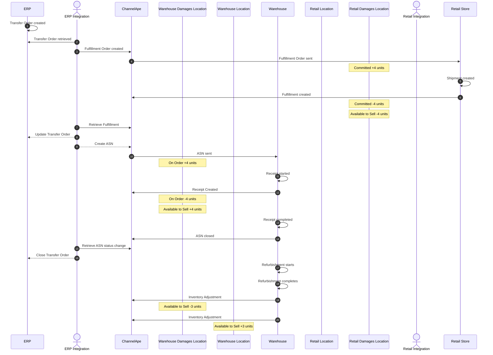

# Transfer Orders

A Transfer Order is a transaction that's created to move inventory from one of your locations to another.

Transfer Orders should be used when inventory has to be shipped and received.

## Warehouse to Retail Store

The scenarios below document the inventory adjustments ChannelApe expects at each stage of the transfer order's journey.

In our examples, we follow a Transfer Order that has been created to physically move 100 units from the Warehouse to the Retail Store.

### 1. No Partial Receipts, No Short Shipment, No Quality Control Adjustments, No Damages

The transfer order is shipped complete and a receipt is sent once completely received.

There are no adjustments to indicate progress of quality control procedures.

Inventory is received in good condition and deemed available to sell.

Show Diagram

### 2. Partial Receipts, No Short Shipment, No Quality Control Adjustments, No Damages

The transfer order is shipped complete and multiple receipts are created throughout the receiving process.

There are no adjustments to indicate progress of quality control procedures.

Inventory is received in good condition and deemed available to sell.

Show Diagram

### 3. Partial Receipts, Short Shipment, No Quality Control Adjustments, No Damages

The transfer order is shipped 5 units short and multiple receipts are created throughout the receiving process.

There are no adjustments to indicate progress of quality control procedures.

Inventory is received in good condition and deemed available to sell.

Show Diagram

### 4. Partial Receipts, Short Shipment, Quality Control Adjustments, No Damages

The transfer order is shipped 5 units short and multiple receipts are created throughout the receiving process.

10 units are selected for population sampling and inspected as part of the Quality Control process.

All 10 units pass inspection and are returned to Available stock.

Show Diagram

### 5. Partial Receipts, Short Shipment, Quality Control Adjustments, Damages

The transfer order is shipped 5 units short and multiple receipts are created throughout the receiving process.

10 units are selected for population sampling and inspected as part of the Quality Control process.

6 units pass inspection and are returned to Available stock.

4 units fail inspection and are transferred to the Damages location.

Show Diagram

## Damages to Warehouse

### 6. Some of the damages are refurbished

In this scenario 4 units are transferred from the retail store to the warehouse for refurbishment.

3 units are refurbished and returned to Available stock.

1 unit remains in damages.

Show Diagram

